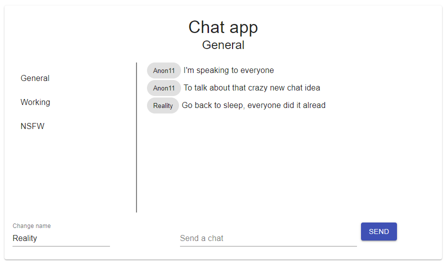

# Live chat with React & Material UI

## What is it
It's an little app to create a chat windows accesible to all users done with:
- Socket.io
- Material-UI
- React



## Prerequisites
- Node.JS, can be installed from here: [https://nodejs.org/en/](https://nodejs.org/en/)
## How to install

```powershell
# clone the repo then go in it
git clone git@github.com:edonadei/live-chat-react-material-ui.git
cd live-chat-react-material-ui

# Install all the dependencies
npm install

# start the server & the front-end
node ./server/index.js & npm start
```
